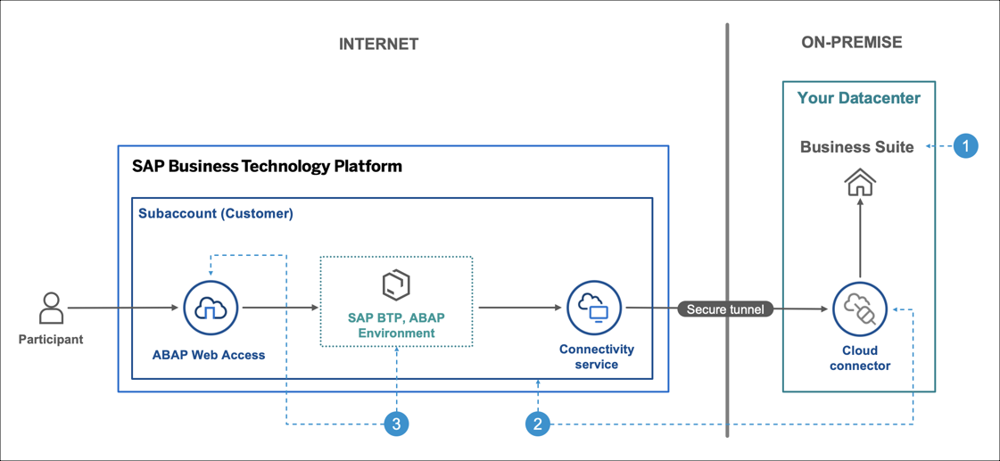

# Custom Code Migration: Setup

## Description

This repository contains the material for the hands-on exercise **Configuring the ABAP Environment to Use the Custom Code Migration App**. **It can be conducted on our prepared landscape and is available on request.**  

## Overview

In this session, you will get hands-on to the **Cloud Integration Automation Service** (CIAS) and configure the Integration Scenario **Configuring the ABAP Environment to Use the Custom Code Migration App** in an automated way.  
You will first configure the **SAP Business Suite** system [1], then prepare the connectivity from the **SAP Business Suite** system to the **SAP Business Technology Platform** (SAP BTP) [2] and finally configure the **Custom Code Migration** app on the **SAP BTP, ABAP Environment** and perform an integration test [3].
  
  

## Requirements

The requirements to follow the exercises in this repository are:

- Web browser (preferably Google Chrome)
- SAP GUI

 

## Exercises

Start the exercises [here](exercises/README.md).  

## Known Issues

None  

## How to obtain support

Support for the content in this repository is available during the actual time of the online session for which this content has been designed. Otherwise, you may request support via the [Issues](../../issues) tab.  
