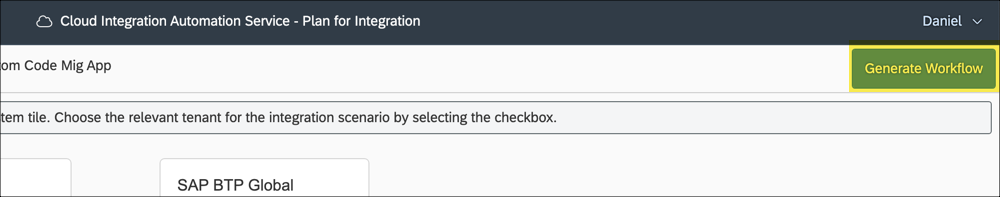
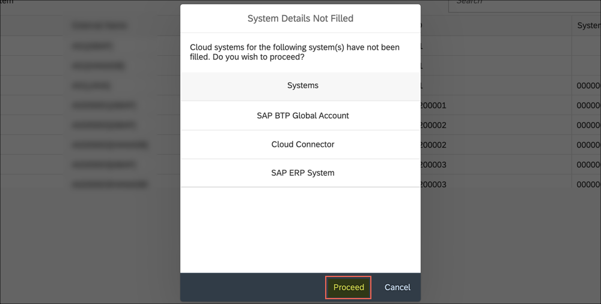
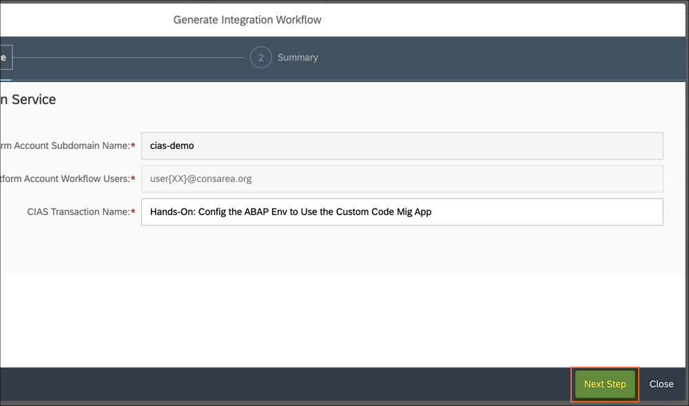
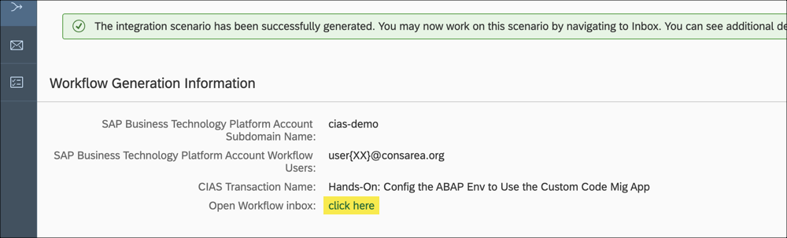
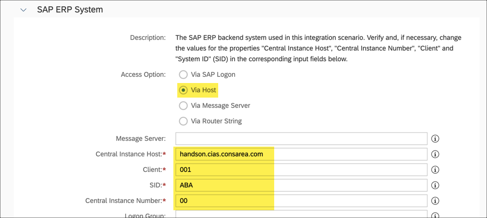
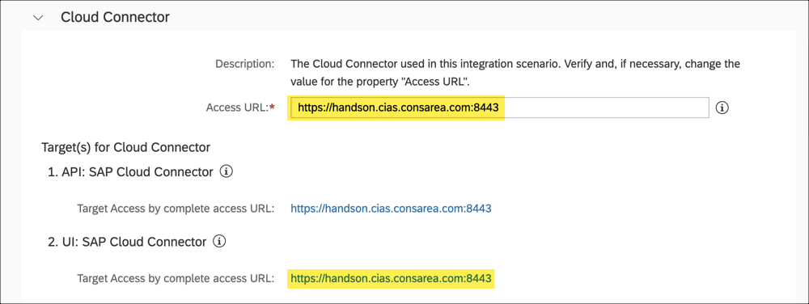

# Exercises - Hands-on

Run the following exercises to complete the hands-on:  

## Reserving an Exercise User

Open the [**User Registration Self-Service**](https://cias-handson-dispatcher.cfapps.eu10.hana.ondemand.com/users/hands-on/reserve) for the hands-on session. A PDF document with the session details is automatically downloaded.  
  
With the user details provided you can log on to all systems required in this hands-on session.  
  
Congratulations! You have successfully reserved your hands-on user.    

## Creating the Workflow Instance

Open the [**CIAS Planning UI**](https://cias-demo.cias-preprod.cfapps.eu10.hana.ondemand.com/#/deeplink/SOLUTION_CIAS_DEMO/SCENARIO_CIAS_CCM_HANDSON/com.sap.btp.abap.ccm.setup.handson) in Google Chrome and logon with the reserved user from the previous exercise [Reserving an Exercise User](#reserving-an-exercise-user).  
The **Configuring the ABAP Environment to Use the Custom Code Migration App** opens using a deep link. Choose **Generate Workflow**.  
  
The **System Details Not Filled** dialog appears. Choose **Proceed**.  

>**NOTE**
>
> Normally, a customer would select the required systems in the step before. Since we are working with a special setup in this hands-on, we will maintain the details later.

 

  
The **Generate Integration Workflow** dialog appears. Keep the default settings and choose **Next Step**.  
  
Choose **Generate** to create a new workflow instance.  
  
Wait until the workflow instance is generated. This can take a few seconds.  
Once the workflow is generated, choose **click here**.  
  
Congratulations! You have successfully created the workflow instance.    

## Running the Workflow

In the previous exercise [Creating the Workflow Instance](#creating-the-workflow-instance) you created the workflow instance and open the workflow instance using **click here**. Let's continue at this point.  
As a first task the **Disclaimer** appears on the screen. Read it carefully and choose **I Agree** to continue.  
  
The **Confirm Systems** dialog appears.  
Continue to the **SAP ERP System** and choose the option **Via Host**.
Enter **handson.cias.consarea.com** as **Central Instance Host**, **001** as **Client**, **ABA** as **SID** (System ID) and **00** as **Central Instance Number**.  
  
Continue to the **SAP Business Technology Platform** system and enter for the field **Global Account URL** the value **https://cockpit.eu10.hana.ondemand.com/cockpit/#/globalaccount/9930f9c2-22fd-4f27-8237-fa1dc2320e1b**.  
  
Switch to the **Cloud Connector** system and enter **https://handson.cias.consarea.com:8443** into the field **Access URL**.  

>**HINT**
>
> If you click on the target links below the system(s), you can test the connection to the corresponding system and verify your inputs.

 

  
Choose **Confirm Systems** to continue.  
  
The **Assign Users To Required Roles** dialog appears. Choose **Assign all roles to my user** and confirm the dialog afterwards with **Confirm Role Assignment**.  
  
The **Confirm the execution scope for the scenario** dialog appears. Select your preferred option (Default: Without Load Balancing (Application Server and Instance No.)) and choose **Confirm Scope Selection**.  
  
  

> **NOTE**
>
> **We have now guided you through the administrative workflow settings and the scope. All other steps are described in the workflow itself, so we didn't document them here in GitHub. Please follow the instructions in the workflow to continue.**

   

## Important
Please observe the following notes when executing the workflow: 

#### Automated Task Execution
Please ensure that you always execute the automation using **Execute Step** [1] before you complete a task using **Task Completed** [2].  
  

#### SAP GUI Shortcut File

Depending on your SAP GUI configuration, the user name may be prefilled when opening the SAP GUI Shortcut File. Please change the user to the reserved user, e.g. USERXX.  
  
